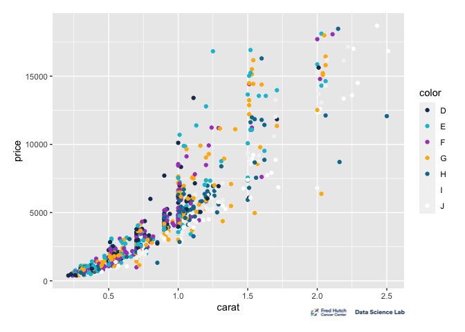
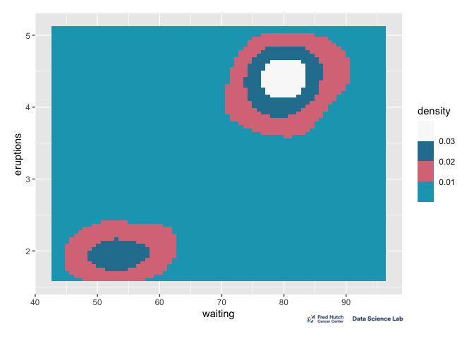

<!-- README.md is generated from README.Rmd. Please edit that file -->

# hutchpalette

<!-- badges: start -->
<!-- badges: end -->

hutchpalette is a color palette package developed specifically for the
Fred Hutchinson Cancer Center. This package leverages the power of
[palettes](https://github.com/mccarthy-m-g/palettes/), an R package
designed for working with color vectors and palettes.

The creation of hutchpalette was a straightforward process that involved
following the step-by-step instructions outlined in the [“Creating a
color palette
package”](https://mccarthy-m-g.github.io/palettes/articles/creating-packages.html)
vignette provided by the palettes R package.

## Installation

You can install the development version of hutchpalette from
[GitHub](https://github.com/) with:

``` r
# install.packages("devtools")
devtools::install_github("howardbaek/hutchpalette")
```

## Using hutchpalette with ggplot2

Code borrowed from [Using palettes with
ggplot2](https://mccarthy-m-g.github.io/palettes/articles/ggplot2.html)

``` r
library(hutchpalette)
#> Loading required package: palettes
library(ggplot2)
library(scales)
```

Show Fred Hutch colors

``` r
plot(hutch_palette)
```


For discrete colors, use `scale_color_palette_d()`.

``` r
ggplot(diamonds[sample(nrow(diamonds), 1000), ], aes(carat, price)) +
  geom_point(aes(colour = color)) +
  scale_colour_palette_d(hutch_palette)
```



Note that `hutch_palette` consists of only 7 colors, which means
plotting a categorical variable with more than 7 distinct values will
throw an error.

``` r
ggplot(diamonds[sample(nrow(diamonds), 1000), ], aes(carat, price)) +
  geom_point(aes(colour = clarity)) +
  scale_colour_palette_d(hutch_palette)
#> Warning: This manual palette can handle a maximum of 7 values. You have
#> supplied 8.
#> Error in `vec_slice()`:
#> ! Can't subset elements past the end.
#> ℹ Location 8 doesn't exist.
#> ℹ There are only 7 elements.
```

Continuous or binned colors can be used with continuous data.

``` r
hwy_mpg <- ggplot(mpg, aes(displ, hwy, colour = hwy)) +
  geom_point()
```

For continuous colors use `scale_color_palette_c()`.

``` r
hwy_mpg + scale_colour_palette_c(hutch_palette)
```


For binned colors use `scale_color_palette_b()`.

``` r
hwy_mpg + scale_colour_palette_b(hutch_palette)
```


For discrete fills, use `scale_fill_palette_d()`.

``` r
ggplot(diamonds, aes(x = price, fill = cut)) +
  geom_histogram(position = "dodge", binwidth = 1000) +
  scale_fill_palette_d(hutch_palette)
```


Continuous or binned fills can be used with continuous data.

``` r
eruptions <- ggplot(faithfuld, aes(waiting, eruptions, fill = density)) +
  geom_tile()
```

For continuous fills use `scale_fill_palette_c()`.

``` r
eruptions + scale_fill_palette_c(hutch_palette)
```


For binned fills use `scale_fill_palette_b()`.

``` r
eruptions + scale_fill_palette_b(hutch_palette)
```


